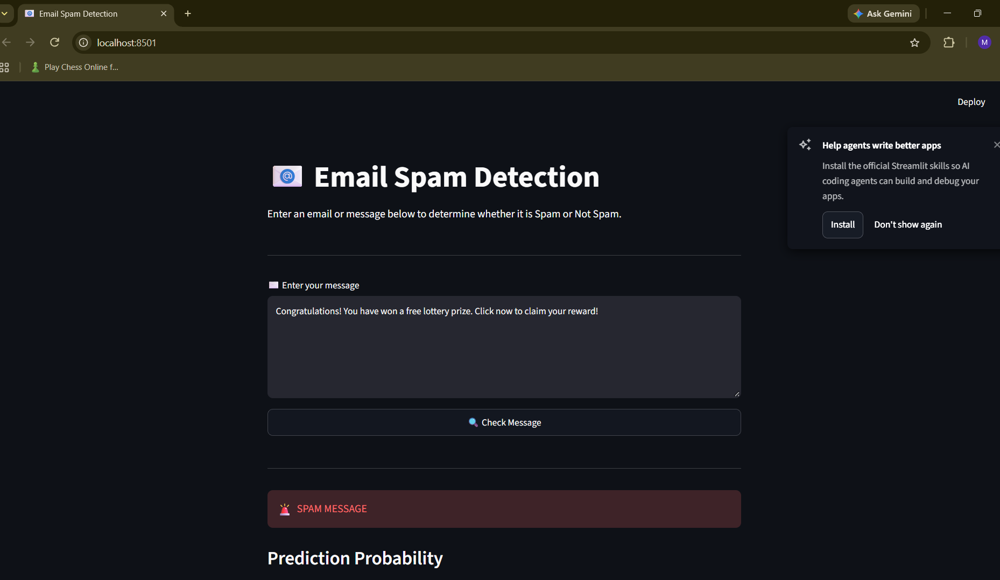
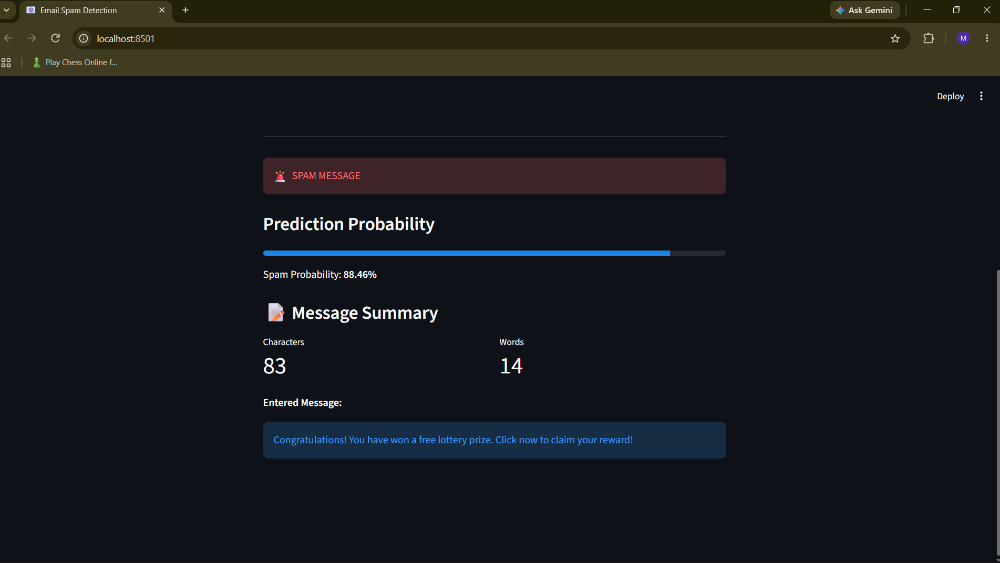
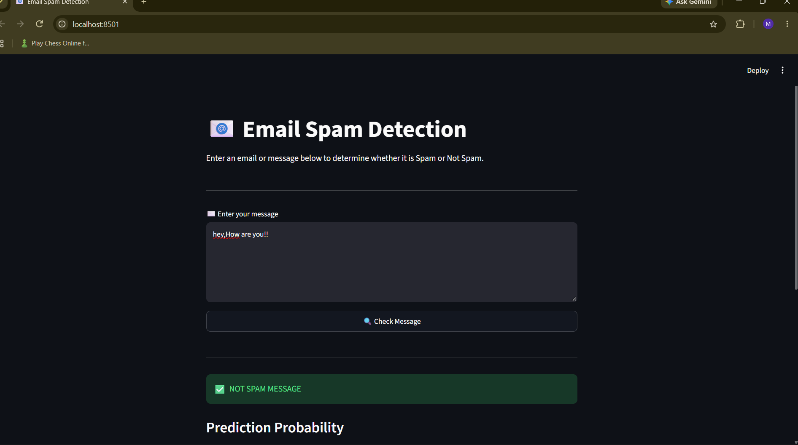
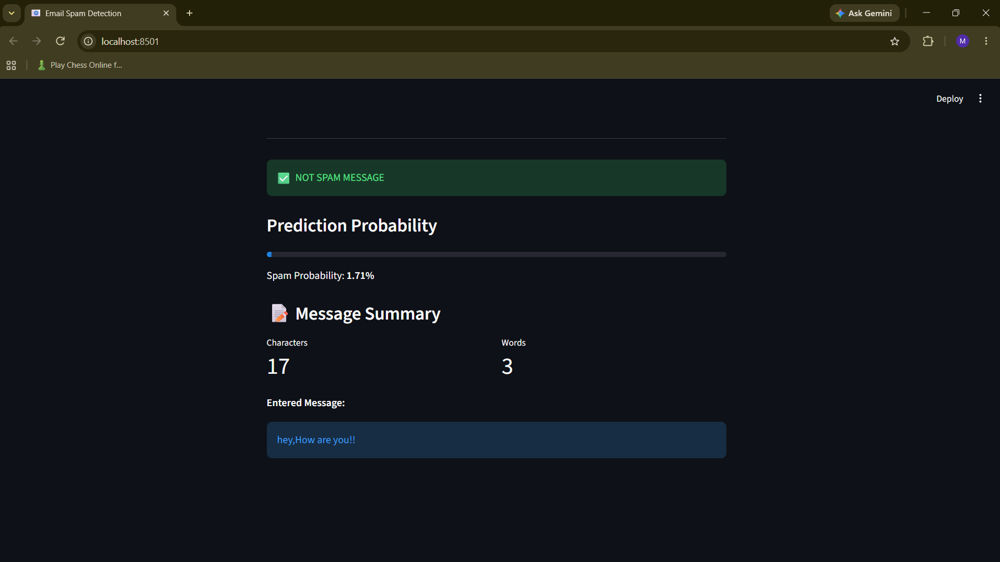
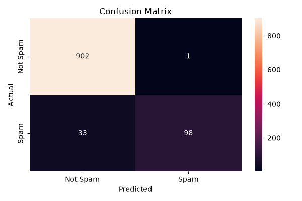

# 📩 SMS Spam Classifier

A Python-based Machine Learning application that analyzes text messages and predicts whether they are **Spam** or **Not Spam**.

## 📌 Project Overview

This project demonstrates a complete Machine Learning workflow for text classification. The system preprocesses messages, converts text into numerical features using TF-IDF, and uses Logistic Regression to make predictions.

A Streamlit interface is included so users can test their own messages.

## 🔧 Tech Stack

- Python
- Pandas
- NumPy
- Scikit-learn
- TF-IDF
- Logistic Regression
- Joblib
- Streamlit
- Matplotlib
- Seaborn

## 📂 Dataset Information

The model is trained using the **SMS Spam Collection** dataset.

The cleaned dataset contains:

| Category | Count |
|---|---:|
| Not Spam | 4,516 |
| Spam | 653 |
| **Total** | **5,169** |

The original dataset contained some unnecessary columns, which were removed during preprocessing.

## ⚙️ Processing Pipeline

```text
Raw Dataset
     ↓
Data Cleaning
     ↓
Text Preprocessing
     ↓
Train / Test Split
     ↓
TF-IDF Feature Extraction
     ↓
Logistic Regression
     ↓
Performance Testing
     ↓
Model Export
     ↓
Streamlit Interface
```

## 🧠 Classification Method

### TF-IDF

TF-IDF converts the words in each message into numerical values based on their importance within the dataset.

### Logistic Regression

The generated TF-IDF features are given to a Logistic Regression classifier, which predicts the category of the message.

The trained model and TF-IDF vectorizer are saved using **Joblib**.

## 📊 Results

The model was tested using several classification metrics:

| Evaluation Metric | Result |
|---|---:|
| Accuracy | 96.71% |
| Precision | 98.99% |
| Recall | 74.81% |
| F1 Score | 85.22% |
| ROC-AUC | 98.92% |

### Confusion Matrix

The test results were:

- **902** Not Spam messages correctly identified
- **98** Spam messages correctly identified
- **1** Not Spam message incorrectly classified as Spam
- **33** Spam messages incorrectly classified as Not Spam

## 🖥️ Web Application

The Streamlit interface provides a simple way to test the trained classifier.

Users can:

- Enter a message.
- Get a Spam / Not Spam prediction.
- See the estimated Spam probability.
- View basic message information such as word and character count.

## 📷 Application Screenshots

### Spam Detection





### Not Spam Detection





### Model Evaluation



## 📁 Repository Layout

```text
email_spam_detect/
│
├── dataset/
│   └── spam.csv
│
├── model/
│   ├── spam_model.pkl
│   └── tfidf_vectorizer.pkl
│
├── screenshots/
│   ├── spam_prediction.png
│   ├── not_spam_prediction.png
│   └── confusion_matrix.png
│
├── train_model.py
├── app.py
├── requirements.txt
└── README.md
```

## 🚀 Running the Project

### Clone the Repository

```bash
git clone <YOUR_GITHUB_REPOSITORY_URL>
```

### Enter the Project Directory

```bash
cd email_spam_detect
```

### Install Dependencies

```bash
pip install -r requirements.txt
```

### Start the Application

```bash
streamlit run app.py
```

The Streamlit application will then be available in your browser.

## ⚠️ Limitations

- The training data is based on the SMS Spam Collection dataset.
- Certain unfamiliar spam patterns may not be detected correctly.
- Performance can vary when the model receives real-world email content.
- The current classifier mainly relies on the text of the message.

## 🔮 Possible Enhancements

Future versions could include:

- Training with a larger and more diverse dataset.
- Additional message features such as links and special characters.
- Comparison with other classification algorithms.
- More advanced text preprocessing.
- Online deployment of the Streamlit application.
